# 第0章	簡單了解框架
&nbsp;&nbsp;&nbsp;&nbsp;框架，即framework。其實就是某種應用的半成品，就是一組組件，供你選用完成你自己的系統。簡單說就是使用別人搭好的舞台，你來做表演。而且，框架一般是成熟的，不斷升級的軟件。  

&nbsp;&nbsp;&nbsp;&nbsp;框架是對特定應用領域中的應用系統的部分設計和實現的整體結構。  

因為軟件系統發展到今天已經很複雜了，特別是服務器端軟件，涉及到的知識，內容，問題太多。在某些方面使用別人成熟的框架，就相當於讓別人幫你完成一些基礎工作，你只需要集中精力完成系統的業務邏輯設計。而且框架一般是成熟，穩健的，他可以處理系統很多細節問題，比如，事務處理，安全性，數據流控制等問題。還有框架一般都經過很多人使用，所以結構很好，所以擴展性也很好，而且它是不斷升級的，你可以直接享受別人升級代碼帶來的好處
    
# 第1章 Spring概述

### 1.1 Spring概述
  1. Spring是一個開源框架    
  2. Spring為簡化企業級開發而生，使用Spring，JavaBean就可以實現很多以前要靠EJB才能實現的功能。同樣的功能，在EJB中要通過繁瑣的配置和復雜的代碼才能夠實現，而在Spring中卻非常的優雅和簡潔。
  3. Spring是一個IOC(DI)和AOP容器框架。
  4. Spring的優良特性
		- 非侵入式：基於Spring開發的應用中的對象可以不依賴於Spring的API
		- 依賴注入：DI——Dependency Injection，反轉控制(IOC)最經典的實現。
		- 面向切面編程：Aspect Oriented Programming——AOP
		- 容器：Spring是一個容器，因為它包含並且管理應用對象的生命週期
		- 組件化：Spring實現了使用簡單的組件配置組合成一個複雜的應用。在 Spring 中可以使用XML和Java註解組合這些對象。
		- 一站式：在IOC和AOP的基礎上可以整合各種企業應用的開源框架和優秀的第三方類庫（實際上Spring 自身也提供了表述層的SpringMVC和持久層的Spring JDBC）。
  5. Spring模塊  
  
	
### 1.2 搭建Spring運行時環境
  1. 加入JAR包  
		1.1 Spring自身JAR包：spring-framework-4.0.0.RELEASE\libs目錄下  
		`spring-beans-4.0.0.RELEASE.jar`    
		`spring-context-4.0.0.RELE2ASE.jar`  
		`spring-core-4.0.0.RELEASE.jar`  
		`spring-expression-4.0.0.RELEASE.jar`  
		1.2 commons-logging-1.1.1.jar
  2. 在Spring Tool Suite工具中通過如下步驟創建Spring的配置文件  
		2.1 File->New->Spring Bean Configuration File  
		2.2 為文件取名字 例如：applicationContext.xml
		
### 1.3 HelloWorld
  1. 目標：使用Spring創建對象，為屬性賦值
  2. 創建Student類  
  
  3. 創建Spring配置文件  
  ```
	<!-- 使用bean元素定義一個由IOC容器創建的對象 -->
	<!-- class屬性指定用於創建bean的全類名 -->
	<!-- id屬性指定用於引用bean實例的標識 -->
	<bean id="student" class="com.atguigu.helloworld.bean.Student">
		<!-- 使用property子元素為bean的屬性賦值 -->
		<property name="studentId" value="1001"/>
		<property name="stuName" value="Tom2015"/>
		<property name="age" value="20"/>
	</bean>
  ```
  4. 測試：通過Spring的IOC容器創建Student類實例  
  ```
	//1.创建IOC容器对象
	ApplicationContext iocContainer = new ClassPathXmlApplicationContext("helloworld.xml");
	
	//2.根据id值获取bean实例对象
	Student student = (Student) iocContainer.getBean("student");
	
	//3.打印bean
	System.out.println(student);
  ```
	  
# 第2章 IOC容器和Bean的配置
	  
### 2.1 IOC和DI
>#### 2.1.1 IOC(Inversion of Control)：反轉控制  
>&nbsp;&nbsp;&nbsp;&nbsp;在應用程序中的組件需要獲取資源時，傳統的方式是組件主動的從容器中獲取所需要的資源，在這樣的模式下開發人員往往需要知道在具體容器中特定資源的獲取方式，增加了學習成本，同時降低了開發效率。  
>&nbsp;&nbsp;&nbsp;&nbsp;反轉控制的思想完全顛覆了應用程序組件獲取資源的傳統方式：反轉了資源的獲取方向——改由容器主動的將資源推送給需要的組件，開發人員不需要知道容器是如何創建資源對象的，只需要提供接收資源的方式即可，極大的降低了學習成本，提高了開發的效率。這種行為也稱為查找的被動形式。  
>&nbsp;&nbsp;&nbsp;&nbsp;傳統方式:   我想吃飯    我需要買菜做飯  
>&nbsp;&nbsp;&nbsp;&nbsp;反轉控制:   我想吃飯    飯來張口
>#### 2.1.2 DI(Dependency Injection)：依賴注入
>&nbsp;&nbsp;&nbsp;&nbsp;IOC的另一種表述方式：即組件以一些預先定義好的方式(例如：setter 方法)接受來自於容器的資源注入。相對於IOC而言，這種表述更直接。  
>&nbsp;&nbsp;&nbsp;&nbsp;總結: IOC 就是一種反轉控制的思想， 而DI是對IOC的一種具體實現。
>#### 2.1.3 IOC容器在Spring中的實現
>&nbsp;&nbsp;&nbsp;&nbsp;前提:  Spring中有IOC思想，  IOC思想必須基於 IOC容器來完成， 而IOC容器在最底層實質上就是一個對象工廠.  
>1. 在通過IOC容器讀取Bean的實例之前，需要先將IOC容器本身實例化。  
>2. Spring提供了IOC容器的兩種實現方式  
>		2.1 BeanFactory：IOC容器的基本實現，是Spring內部的基礎設施，是面向Spring本身的，不是提供給開發人員使用的。  
>		2.2 ApplicationContext：BeanFactory的子接口，提供了更多高級特性。面向Spring的使用者，幾乎所有場合都使用ApplicationContext而不是底層的BeanFactory。
>#### 2.1.4 ApplicationContext的主要實現類
>1. ClassPathXmlApplicationContext：對應類路徑下的XML格式的配置文件
>2. FileSystemXmlApplicationContext：對應文件系統中的XML格式的配置文件
>3. 在初始化時就創建單例的bean，也可以通過配置的方式指定創建的Bean是多實例的。
>#### 2.1.5 ConfigurableApplicationContext
>1. 是ApplicationContext的子接口，包含一些擴展方法
>2. refresh()和close()讓ApplicationContext具有啟動、關閉和刷新上下文的能力。
>#### 2.1.6 WebApplicationContext
>1. 專門為WEB應用而準備的，它允許從相對於WEB根目錄的路徑中完成初始化工作
>#### 2.1.7 容器的結構圖  
>

### 2.2 通過類型獲取bean
1. 從IOC容器中獲取bean時，除了通過id值獲取，還可以通過bean的類型獲取。但如果同一個類型的bean在XML文件中配置了多個，則獲取時會拋出異常，所以同一個類型的bean在容器中必須是唯一的。  
`HelloWorld helloWorld = cxt.getBean(HelloWorld. class);`
2. 或者可以使用另外一個重載的方法，同時指定bean的id值和類型  
`HelloWorld helloWorld = cxt.getBean(“helloWorld”,HelloWorld. class);`

### 2.3 給bean的屬性賦值
>#### 2.3.1 依賴注入的方式
>1. 通過bean的setXxx()方法賦值  
>Hello World中使用的就是這種方式  
>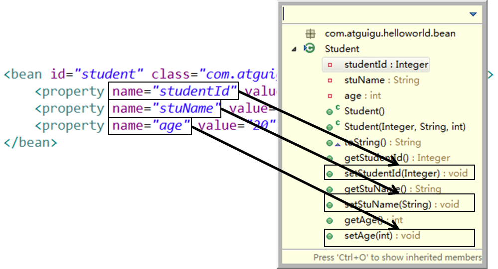
>2. 通過bean的構造器賦值  
>		2.1 Spring自動匹配合適的構造器  
>```
>	<bean id="book" class="com.atguigu.spring.bean.Book" >
>		<constructor-arg value= "10010"/>
>		<constructor-arg value= "Book01"/>
>		<constructor-arg value= "Author01"/>
>		<constructor-arg value= "20.2"/>
>	</bean >
>```
>&nbsp;&nbsp;&nbsp;&nbsp;
>		2.2 通過索引值指定參數位置  
>```
>	<bean id="book" class="com.atguigu.spring.bean.Book" >
>		<constructor-arg value= "10010" index ="0"/>
>		<constructor-arg value= "Book01" index ="1"/>
>		<constructor-arg value= "Author01" index ="2"/>
>		<constructor-arg value= "20.2" index ="3"/>
>	</bean >
>```
>&nbsp;&nbsp;&nbsp;&nbsp;
>		2.3 通過類型區分重載的構造器  
>```
>	<bean id="book" class="com.atguigu.spring.bean.Book" >
>		<constructor-arg value= "10010" index ="0" type="java.lang.Integer" />
>		<constructor-arg value= "Book01" index ="1" type="java.lang.String" />
>		<constructor-arg value= "Author01" index ="2" type="java.lang.String" />
>		<constructor-arg value= "20.2" index ="3" type="java.lang.Double" />
>	</bean >
>```
>#### 2.3.2  p名稱空間
>&nbsp;&nbsp;&nbsp;&nbsp;為了簡化XML文件的配置，越來越多的XML文件採用屬性而非子元素配置信息。 Spring	從2.5版本開始引入了一個新的p命名空間，可以通過<bean>元素屬性的方式配置Bean	的屬性。使用p命名空間後，基於XML的配置方式將進一步簡化。
>```
><bean 
>	id="studentSuper" 
>	class="com.atguigu.helloworld.bean.Student"
>	p:studentId="2002" p:stuName="Jerry2016" p:age="18" />
>```
>#### 2.3.3 可以使用的值
>	1. 字面量
>		1.1 可以使用字符串表示的值，可以通過value屬性或value子節點的方式指定  
>		1.2 基本數據類型及其封裝類、String等類型都可以採取字面值注入的方式  
>		1.3 若字面值中包含特殊字符，可以使用<strong>&lt;![CDATA[]]&gt;</strong>把字面值包裹起來
>	2. null值
>```
>	<bean class="com.atguigu.spring.bean.Book" id="bookNull" >
>		<property name= "bookId" value ="2000"/>
>		<property name= "bookName">
>		<null/>
>		</property>
>		<property name= "author" value ="nullAuthor"/>
>		<property name= "price" value ="50"/>
>	</bean >
>```
>	3. 給bean的級聯屬性賦值
>```
>	<bean id="action" class="com.atguigu.spring.ref.Action">
>		<property name="service" ref="service"/>
>		<!-- 設置級聯屬性(了解) -->
>		<property name="service.dao.dataSource" value="DBCP"/>
>	</bean>
>```
>	4. 外部已聲明的bean、引用其他的bean
>```
>	<bean id="shop" class="com.atguigu.spring.bean.Shop" >
>		<property name= "book" ref ="book"/>
>	</bean >
>```
>	5. 內部bean  
>&nbsp;&nbsp;&nbsp;&nbsp;當bean實例僅僅給一個特定的屬性使用時，可以將其聲明為內部bean。內部bean聲明直接包含在<property>或<constructor-arg>元素裡，不需要設置任何id或name屬性  
>&nbsp;&nbsp;&nbsp;&nbsp;內部bean不能使用在任何其他地方
>```
>	<bean id="shop2" class="com.atguigu.spring.bean.Shop" >
>		<property name= "book">
>			<bean class= "com.atguigu.spring.bean.Book" >
>				<property name= "bookId" value ="1000"/>
>				<property name= "bookName" value="innerBook" />
>				<property name= "author" value="innerAuthor" />
>				<property name= "price" value ="50"/>
>			</bean>
>		</property>
>	</bean >
>```
	
### 2.4 集合屬性
&nbsp;&nbsp;&nbsp;&nbsp;在Spring中可以通過一組內置的XML標籤來配置集合屬性，例如：\<list\>，\<set\>或\<map\>。
>#### 2.4.1 數組和List
>&nbsp;&nbsp;&nbsp;&nbsp;配置java.util.List類型的屬性，需要指定\<list\>標籤，在標籤裡包含一些元素。這些標籤可以通過\<value\>指定簡單的常量值，通過\<ref\>指定對其他Bean的引用。通過\<bean\>指定內置bean定義。通過\<null/\>指定空元素。甚至可以內嵌其他集合。  
>&nbsp;&nbsp;&nbsp;&nbsp;數組的定義和List一樣，都使用\<list\>元素。  
>&nbsp;&nbsp;&nbsp;&nbsp;配置java.util.Set需要使用\<set\>標籤，定義的方法與List一樣。  
>```
>	<bean id="shop" class="com.atguigu.spring.bean.Shop" >
>		<property name= "categoryList">
>			<!-- 以字面量為值的List集合 -->
>			<list>
>				<value> 歷史</value >
>				<value> 軍事</value >
>			</list>
>		</property>
>		<property name= "bookList">
>			<!-- 以bean的引用為值的List集合 -->
>			<list>
>				<ref bean= "book01"/>
>				<ref bean= "book02"/>
>			</list>
>		</property>
>	</bean >
>```
>#### 2.4.2 Map
>&nbsp;&nbsp;&nbsp;&nbsp;Java.util.Map通過\<map\>標籤定義，\<map\>標籤裡可以使用多個\<entry\>作為子標籤。每個條目包含一個鍵和一個值。
必須在\<key\>標籤裡定義鍵。  
>&nbsp;&nbsp;&nbsp;&nbsp;因為鍵和值的類型沒有限制，所以可以自由地為它們指定\<value\>、\<ref\>、\<bean\>或\<null/\>元素。  
>&nbsp;&nbsp;&nbsp;&nbsp;可以將Map的鍵和值作為\<entry\>的屬性定義：簡單常量使用key和value來定義；bean引用通過key-ref和value-ref屬性定義。  
>```
><bean id="cup" class="com.atguigu.spring.bean.Cup">
>	<property name="bookMap">
>		<map>
>			<entry>
>				<key>
>					<value>bookKey01</value>
>				</key>
>				<ref bean="book01"/>
>			</entry>
>			<entry>
>				<key>
>					<value>bookKey02</value>
>				</key>
>				<ref bean="book02"/>
>			</entry>
>		</map>
>	</property>
></bean>
>```
>#### 2.4.3 集合類型的bean
>&nbsp;&nbsp;&nbsp;&nbsp;如果只能將集合對象配置在某個bean內部，則這個集合的配置將不能重用。我們需要將集合bean的配置拿到外面，供其他bean引用。  
>&nbsp;&nbsp;&nbsp;&nbsp;配置集合類型的bean需要引入util名稱空間  
>```
><util:list id="bookList">
>	<ref bean="book01"/>
>	<ref bean="book02"/>
>	<ref bean="book03"/>
>	<ref bean="book04"/>
>	<ref bean="book05"/>
></util:list>
>
><util:list id="categoryList">
>	 <value>編程</value>
>	 <value>極客</value>
>	 <value>相聲</value>
>	 <value>評書</value>
></util:list>
>```
	
### 2.5  FactoryBean	   
> #### 2.5.1 FactoryBean
>&nbsp;&nbsp;&nbsp;&nbsp;Spring中有兩種類型的bean，一種是普通bean，另一種是工廠bean，即FactoryBean。  
>&nbsp;&nbsp;&nbsp;&nbsp;工廠bean跟普通bean不同，其返回的對像不是指定類的一個實例，其返回的是該工廠bean的getObject方法所返回的對象。  
>&nbsp;&nbsp;&nbsp;&nbsp;工廠bean必須實現org.springframework.beans.factory.FactoryBean接口。  
>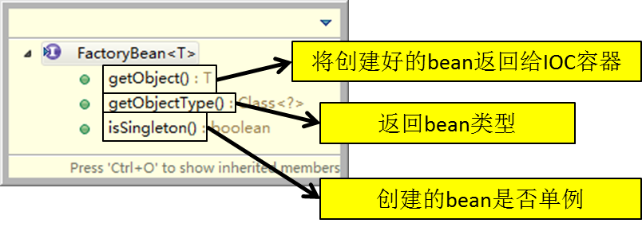
>```
><bean id="product" class="com.atguigu.spring.bean.ProductFactory">
>	<property name="productName" value="Mp3" />
></bean>
>```

### 2.6  bean的作用域
&nbsp;&nbsp;&nbsp;&nbsp;在Spring中，可以在<bean>元素的scope屬性裡設置bean的作用域，以決定這個bean是單實例的還是多實例的。  
&nbsp;&nbsp;&nbsp;&nbsp;默認情況下，Spring只為每個在IOC容器裡聲明的bean創建唯一一個實例，整個IOC容器範圍內都能共享該實例：所有後續的getBean()調用和bean引用都將返回這個唯一的bean實例。該作用域被稱為singleton，它是所有bean的默認作用域。  
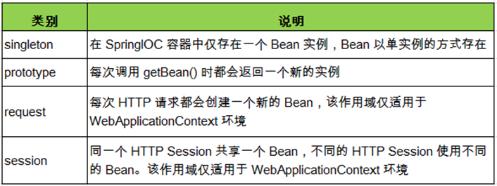  
而當bean的作用域為prototype時，IOC容器在獲取bean的實例時創建bean的實例對象。
	
### 2.7  bean的生命週期
  1. Spring IOC容器可以管理bean的生命週期，Spring允許在bean生命週期內特定的時間點執行指定的任務。
  2. Spring IOC容器對bean的生命週期進行管理的過程：  
	① 通過構造器或工廠方法創建bean實例  
	② 為bean的屬性設置值和對其他bean的引用  
	③ 調用bean的初始化方法  
	④ bean可以使用了  
	⑤ 當容器關閉時，調用bean的銷毀方法  
  3. 在配置bean時，通過init-method和destroy-method 屬性為bean指定初始化和銷毀方法
  4. bean的後置處理器  
	① bean後置處理器允許在調用初始化方法前後對bean進行額外的處理  
	② bean後置處理器對IOC容器裡的所有bean實例逐一處理，而非單一實例。  
&nbsp;&nbsp;&nbsp;&nbsp;&nbsp;&nbsp;其典型應用是：檢查bean屬性的正確性或根據特定的標準更改bean的屬性。  
	③ bean後置處理器需要實現接口：  
&nbsp;&nbsp;&nbsp;&nbsp;&nbsp;&nbsp;org.springframework.beans.factory.config.BeanPostProcessor。  
&nbsp;&nbsp;&nbsp;&nbsp;&nbsp;&nbsp;在初始化方法被調用前後，Spring將把每個bean實例分別傳遞給上述接口的以下兩個方法：  
		- postProcessBeforeInitialization(Object, String)  
		- postProcessAfterInitialization(Object, String)
  5. 添加bean後置處理器後bean的生命週期  
	① 通過構造器或工廠方法創建bean實例  
	② 為bean的屬性設置值和對其他bean的引用  
	③ 將bean實例傳遞給bean後置處理器的postProcessBeforeInitialization()方法  
	④ 調用bean的初始化方法  
	⑤ 將bean實例傳遞給bean後置處理器的postProcessAfterInitialization()方法  
	⑥ bean可以使用了  
	⑦ 當容器關閉時調用bean的銷毀方法  

### 2.8 引用外部屬性文件
&nbsp;&nbsp;&nbsp;&nbsp;當bean的配置信息逐漸增多時，查找和修改一些bean的配置信息就變得愈加困難。這時可以將一部分信息提取到bean配置文件的外部，以properties格式的屬性文件保存起來，同時在bean的配置文件中引用properties屬性文件中的內容，從而實現一部分屬性值在發生變化時僅修改properties屬性文件即可。這種技術多用於連接數據庫的基本信息的配置。
>#### 2.8.1 直接配置
>```
><!-- 直接配置 -->
><bean id="dataSource" class="com.mchange.v2.c3p0.ComboPooledDataSource">
>	<property name="user" value="root"/>
>	<property name="password" value="root"/>
>	<property name="jdbcUrl" value="jdbc:mysql:///test"/>
>	<property name="driverClass" value="com.mysql.jdbc.Driver"/>
></bean>
>```
>#### 2.8.2 使用外部的屬性文件
>	1. 創建properties屬性文件
>```
>prop.userName=root
>prop.password=root
>prop.url=jdbc:mysql:///test
>prop.driverClass=com.mysql.jdbc.Driver
>```
>	2. 引入context名稱空間  
>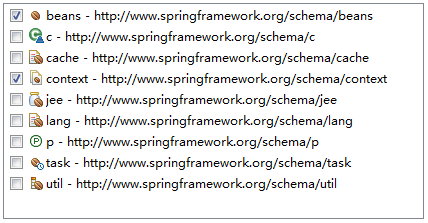  
>	3. 指定properties屬性文件的位置
>```
><!-- 指定properties屬性文件的位置 -->
><!-- classpath:xxx 表示屬性文件位於類路徑下 -->
><context:property-placeholder location="classpath:jdbc.properties"/>
>```
>	4. 從properties屬性文件中引入屬性值
>```
><!-- 從properties屬性文件中引入屬性值 -->
><bean id="dataSource" class="com.mchange.v2.c3p0.ComboPooledDataSource">
>	<property name="user" value="${prop.userName}"/>
>	<property name="password" value="${prop.password}"/>
>	<property name="jdbcUrl" value="${prop.url}"/>
>	<property name="driverClass" value="${prop.driverClass}"/>
></bean>
>```
	
### 2.9自動裝配
>#### 2.9.1 自動裝配的概念
>	1. 手動裝配：以value或ref的方式明確指定屬性值都是手動裝配。
>	2. 自動裝配：根據指定的裝配規則，不需要明確指定，Spring自動將匹配的屬性值注入bean中。
>#### 2.9.2 裝配模式
>	1. 根據類型自動裝配：將類型匹配的bean作為屬性注入到另一個bean中。若IOC容器中有多個與目標bean類型一致的bean，Spring將無法判定哪個bean最合適該屬性，所以不能執行自動裝配
>	2. 根據名稱自動裝配：必須將目標bean的名稱和屬性名設置的完全相同
>	3. 通過構造器自動裝配：當bean中存在多個構造器時，此種自動裝配方式將會很複雜。不推薦使用。
>#### 2.9.3 選用建議	
>&nbsp;&nbsp;&nbsp;&nbsp;相對於使用註解的方式實現的自動裝配，在XML文檔中進行的自動裝配略顯笨拙，在項目中更多的使用註解的方式實現。

### 2.10 通過註解配置bean 
>#### 2.10.1 概述
>&nbsp;&nbsp;&nbsp;&nbsp;相對於XML方式而言，通過註解的方式配置bean更加簡潔和優雅，而且和MVC組件化開發的理念十分契合，是開發中常用的使用方式。
>#### 2.10.2 使用註解標識組件
>	1. 普通組件：@Component  
	`標識一個受Spring IOC容器管理的組件`
>	2. 持久化層組件：@Repository  
	`標識一個受Spring IOC容器管理的持久化層組件`
>	3. 業務邏輯層組件：@Service  
	`標識一個受Spring IOC容器管理的業務邏輯層組件`
>	4. 表述層控制器組件：@Controller  
	`標識一個受Spring IOC容器管理的表述層控制器組件`
>	5. 組件命名規則  
	① 默認情況：使用組件的簡單類名首字母小寫後得到的字符串作為bean的id  
	② 使用組件註解的value屬性指定bean的id  
	注意：事實上Spring並沒有能力識別一個組件到底是不是它所標記的類型，即使將@Respository註解用在一個表述層控制器組件上面也不會產生任何錯誤，所以@Respository、@Service、@Controller這幾個註解僅僅是為了讓開發人員自己明確當前的組件扮演的角色。
>#### 2.10.3  掃描組件
>&nbsp;&nbsp;&nbsp;&nbsp;組件被上述註解標識後還需要通過Spring進行掃描才能夠偵測到。
>	1. 指定被掃描的package
>```
><context:component-scan base-package="com.atguigu.component"/>
>```
>	2. 詳細說明  
	① base-package屬性指定一個需要掃描的基類包，Spring容器將會掃描這個基類包及其子包中的所有類。  
	② 當需要掃描多個包時可以使用逗號分隔。  
	③ 如果僅希望掃描特定的類而非基包下的所有類，可使用resource-pattern屬性過濾特定的類，示例：  
>```
><context:component-scan 
>	base-package="com.atguigu.component" 
>	resource-pattern="autowire/*.class"/>
>```  
>&nbsp;&nbsp;&nbsp;&nbsp;&nbsp;&nbsp;&nbsp;&nbsp;④ 包含與排除  
>&nbsp;&nbsp;&nbsp;&nbsp;&nbsp;&nbsp;&nbsp;&nbsp;&nbsp;&nbsp;&nbsp;&nbsp;&nbsp;&nbsp;●&nbsp;&nbsp;&lt;context:include-filter&gt;子節點表示要包含的目標類  
>&nbsp;&nbsp;&nbsp;&nbsp;&nbsp;&nbsp;&nbsp;&nbsp;&nbsp;&nbsp;&nbsp;&nbsp;&nbsp;&nbsp;&nbsp;&nbsp;&nbsp;&nbsp;&nbsp;&nbsp;&nbsp;&nbsp;注意：通常需要與use-default-filters屬性配合使用才能夠達到"僅包含某些組>>件"這樣的效果。  
>&nbsp;&nbsp;&nbsp;&nbsp;&nbsp;&nbsp;&nbsp;&nbsp;&nbsp;&nbsp;&nbsp;&nbsp;&nbsp;&nbsp;&nbsp;&nbsp;&nbsp;&nbsp;&nbsp;&nbsp;&nbsp;&nbsp;即：通過將use-default-filters屬性設置為false，禁用默認過濾器，然後掃描的就只是include-filter中的規則指定的組件了。  
>&nbsp;&nbsp;&nbsp;&nbsp;&nbsp;&nbsp;&nbsp;&nbsp;&nbsp;&nbsp;&nbsp;&nbsp;&nbsp;&nbsp;●&nbsp;&nbsp;&lt;context:exclude-filter&gt;子節點表示要排除在外的目標類  
>&nbsp;&nbsp;&nbsp;&nbsp;&nbsp;&nbsp;&nbsp;&nbsp;&nbsp;&nbsp;&nbsp;&nbsp;&nbsp;&nbsp;●&nbsp;&nbsp;component-scan下可以擁有若干個include-filter和exclude-filter子節點  
>&nbsp;&nbsp;&nbsp;&nbsp;&nbsp;&nbsp;&nbsp;&nbsp;&nbsp;&nbsp;&nbsp;&nbsp;&nbsp;&nbsp;●&nbsp;&nbsp;過濾表達式  
>類別		|示例						|說明
>-|:-|-
>annotation	|com.atguigu.XxxAnnotation	|過濾所有標注了XxxAnnotation的類。這個規則根據目標群組件是否標注了指定類型的注解進行過濾。
>assignable	|com.atguigu.BaseXxx		|過濾所有BaseXxx類的子類。這個規則根據目標群組件是否是指定類型的子類的方式進行過濾。
>aspectj		|com.atguigu.*Service+		|所有類名是以Service結束的，或這樣的類的子類。這個規則根據AspectJ運算式進行過濾。
>regex		|com\\.atguigu\\.anno\\.*		|所有com.atguigu.anno包下的類。這個規則根據規則運算式匹配到的類名進行過濾。
>custom		|com.atguigu.XxxTypeFilter	|使用XxxTypeFilter類通過編碼的方式自訂過濾規則。該類必須實現org.springframework.core.type.filter.TypeFilter介面
>	3. JAR包  
>&nbsp;&nbsp;必須在原有JAR包組合的基礎上再導入一個：spring-aop-4.0.0.RELEASE.jar
>#### 2.10.4 組件裝配
>	1. 需求  
>	Controller元件中往往需要用到Service元件的實例，Service元件中往往需要用到Repository元件的實例。Spring可以通過注解的方式幫我們實現屬性的裝配。
>	2. 實現依據  
>	在指定要掃描的包時，&lt;context:component-scan&gt; 元素會自動註冊一個bean的後置處理器：AutowiredAnnotationBeanPostProcessor的實例。該後置處理器可以自動裝配標記了@Autowired、@Resource或@Inject注解的屬性。
>	3. @Autowired注解  
>	① 根據類型實現自動裝配。  
	② 構造器、普通欄位(即使是非public)、一切具有參數的方法都可以應用@Autowired注解  
	③ 預設情況下，所有使用@Autowired注解的屬性都需要被設置。當Spring找不到匹配的bean裝配屬性時，會拋出異常。  
	④ 若某一屬性允許不被設置，可以設置@Autowired注解的required屬性為 false  
	⑤ 預設情況下，當IOC容器裡存在多個類型相容的bean時，Spring會嘗試匹配bean的id值是否與變數名相同，如果相同則進行裝配。如果bean的id值不相同，通過類型的自動裝配將無法工作。此時可以在@Qualifier注解裡提供bean的名稱。Spring甚至允許在方法的形參上標注@Qualifiter注解以指定注入bean的名稱。  
	⑥ @Autowired注解也可以應用在陣列類型的屬性上，此時Spring將會把所有匹配的bean進行自動裝配。  
	⑦ @Autowired注解也可以應用在集合屬性上，此時Spring讀取該集合的類型資訊，然後自動裝配所有與之相容的bean。  
	⑧ @Autowired注解用在java.util.Map上時，若該Map的鍵值為String，那麼 Spring將自動裝配與數值型別相容的bean作為值，並以bean的id值作為鍵。  
>	4. @Resource  
	@Resource注解要求提供一個bean名稱的屬性，若該屬性為空，則自動採用標注處的變數或方法名作為bean的名稱。
>	5. @Inject  
	@Inject和@Autowired注解一樣也是按類型注入匹配的bean，但沒有reqired屬性。

# 第3章 AOP前奏 
	
### 3.1 提出問題
>#### 3.1.1 情景：數學計算器 
>	1. 要求  
	① 執行加減乘除運算  
	② 日誌：在程式執行期間追蹤正在發生的活動  
	③ 驗證：希望計算器只能處理正數的運算  
>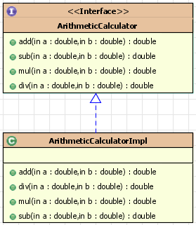
>	2. 常規實現  
>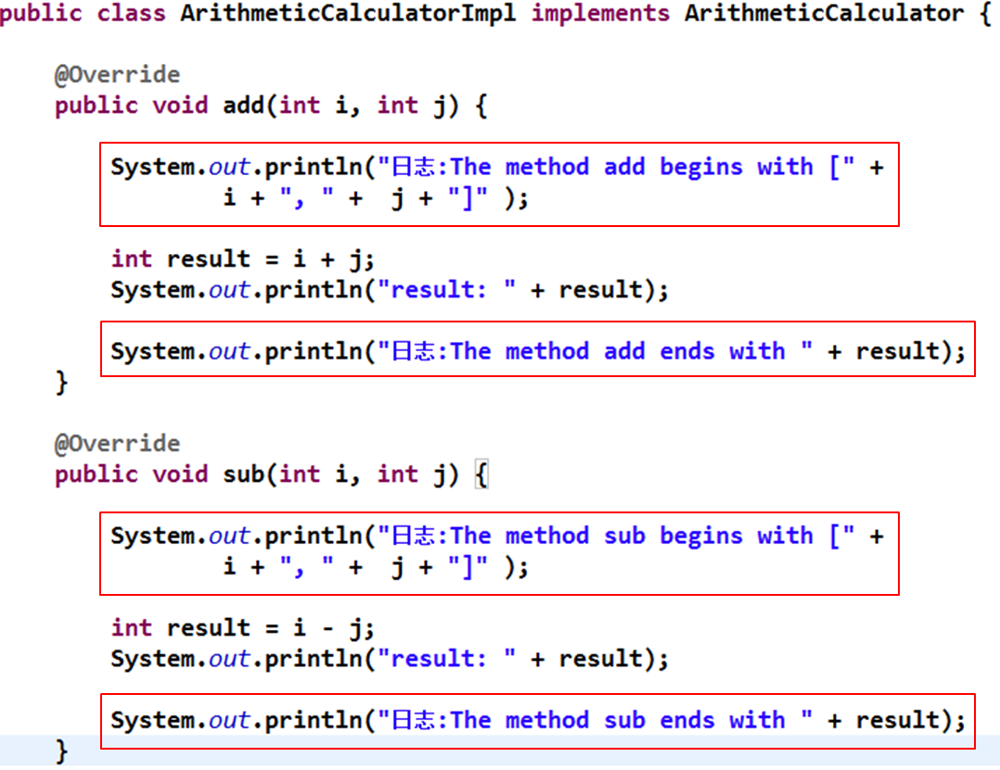
>	3. 問題  
	① 代碼混亂：越來越多的非業務需求(日誌和驗證等)加入後，原有的業務方法急劇膨脹。每個方法在處理核心邏輯的同時還必須兼顧其他多個關注點。  
	② 代碼分散: 以日誌需求為例，只是為了滿足這個單一需求，就不得不在多個模組（方法）裡多次重複相同的日誌代碼。如果日誌需求發生變化，必須修改所有模組。

### 3.2 動態代理
>#### 3.2.1 動態代理的原理  
>&nbsp;&nbsp;&nbsp;&nbsp;代理設計模式的原理：使用一個代理將原本物件包裝起來，然後用該代理物件”取代”原始物件。任何對原始物件的調用都要通過代理。代理物件決定是否以及何時將方法調用轉到原始物件上。  
>
>#### 3.2.2 動態代理的方式
>	1. 基於介面實現動態代理： JDK動態代理
>	2. 基於繼承實現動態代理： Cglib、Javassist動態代理 

### 3.3 數學計算器的改進
>#### 3.3.1 日誌處理器
>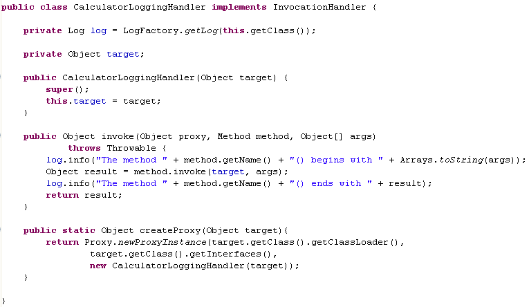
>#### 3.3.2 驗證處理器
>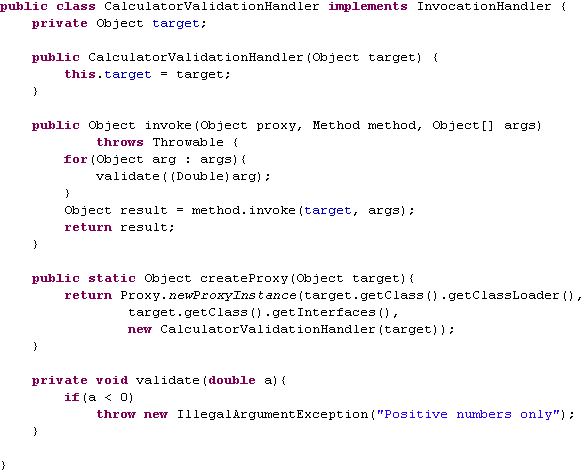
>#### 3.3.3 測試代碼
>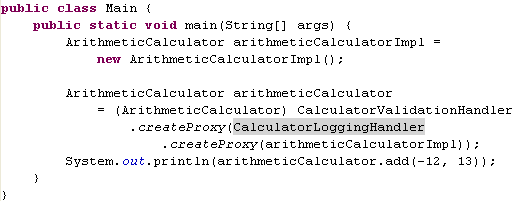
>#### 3.3.4 保存生成的動態代理類
>```
>	在測試方法中加入如下代碼：
>	Properties properties = System.getProperties();
>	properties.put("sun.misc.ProxyGenerator.saveGeneratedFiles", "true");
>```
	
# 第4章  AOP概述 

### 4.1 AOP概述
  1. AOP(Aspect-Oriented Programming，面向切面程式設計)：是一種新的方法論，是對傳統OOP(Object-Oriented Programming，物件導向程式設計)的補充。  
  `物件導向  縱向繼承機制`  
  `面向切面  橫向抽取機制`
  2. AOP程式設計操作的主要對像是切面(aspect)，而切面用於模組化橫切關注點（公共功能）。  
  3. 在應用AOP程式設計時，仍然需要定義公共功能，但可以明確的定義這個功能應用在哪裡，以什麼方式應用，並且不必修改受影響的類。這樣一來橫切關注點就被模組化到特殊的類裡——這樣的類我們通常稱之為"切面"。
  4. AOP的好處：   
  ① 每個事物邏輯位於一個位置，代碼不分散，便於維護和升級  
  ② 業務模組更簡潔，只包含核心業務代碼  
  ③ AOP圖解  
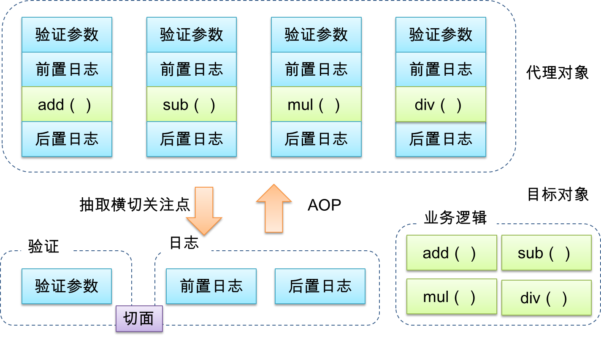
	
### 4.2 AOP術語
>#### 4.2.1 橫切關注點
>&nbsp;&nbsp;&nbsp;&nbsp;從每個方法中抽取出來的同一類非核心業務。
>#### 4.2.2 切面(Aspect)
>&nbsp;&nbsp;&nbsp;&nbsp;封裝橫切關注點資訊的類，每個關注點體現為一個通知方法。
>#### 4.2.3 通知(Advice)
>&nbsp;&nbsp;&nbsp;&nbsp;切面必須要完成的各個具體工作
>#### 4.2.4 目標(Target)
>&nbsp;&nbsp;&nbsp;&nbsp;被通知的物件
>#### 4.2.5 代理(Proxy)
>&nbsp;&nbsp;&nbsp;&nbsp;向目標物件應用通知之後創建的代理物件
>#### 4.2.6 連接點(Joinpoint)
>&nbsp;&nbsp;&nbsp;&nbsp;橫切關注點在程式碼中的具體體現，對應程式執行的某個特定位置。例如：類某個方法調用前、調用後、方法捕獲到異常後等。  
>&nbsp;&nbsp;&nbsp;&nbsp;在應用程式中可以使用橫縱兩個座標來定位一個具體的連接點：  
>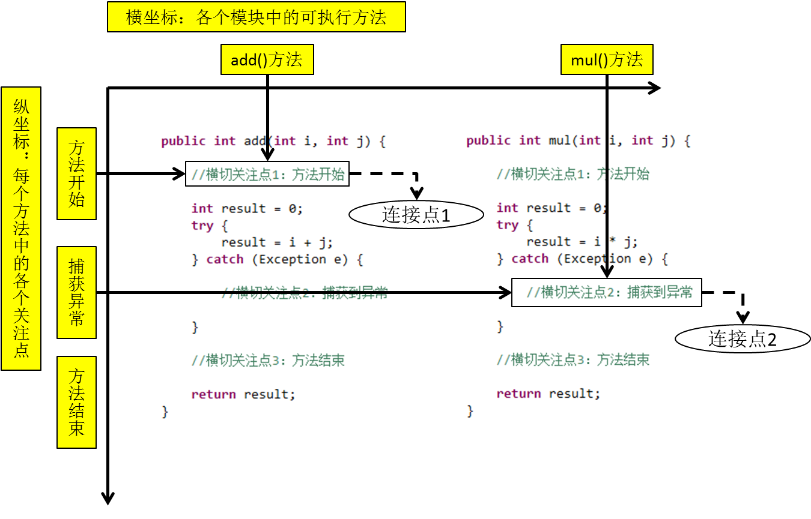
>#### 4.2.7 切入點(pointcut)：
>&nbsp;&nbsp;&nbsp;&nbsp;定位連接點的方式。每個類的方法中都包含多個連接點，所以連接點是類中客觀存在的事物。如果把連接點看作資料庫中的記錄，那麼切入點就是查詢準則——AOP可以通過切入點定位到特定的連接點。切點通過org.springframework.aop.Pointcut 介面進行描述，它使用類和方法作為連接點的查詢準則。
>#### 4.2.8 圖解
>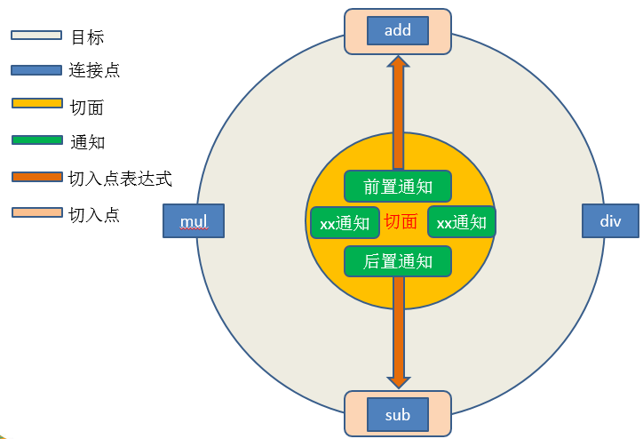
	
### 4.3 AspectJ
>#### 4.3.1 簡介
>&nbsp;&nbsp;&nbsp;&nbsp;AspectJ：Java社區裡最完整最流行的AOP框架。
>&nbsp;&nbsp;&nbsp;&nbsp;在Spring2.0以上版本中，可以使用基於AspectJ注解或基於XML配置的AOP。
>#### 4.3.2 在Spring中啟用AspectJ注解支持
>	1. 導入JAR包  
>	`com.springsource.net.sf.cglib-2.2.0.jar`  
>	`com.springsource.org.aopalliance-1.0.0.jar`  
>	`com.springsource.org.aspectj.weaver-1.6.8.RELEASE.jar `  
>	`spring-aop-4.0.0.RELEASE.jar`  
>	`spring-aspects-4.0.0.RELEASE.jar`  
>	2. 引入aop名稱空間  
>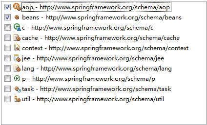
>	3. 配置  
>	&lt;aop:aspectj-autoproxy&gt;  
>	當Spring IOC容器偵測到bean設定檔中的&lt;aop:aspectj-autoproxy&gt;元素時，會自動為與AspectJ切面匹配的bean創建代理
>#### 4.3.3 用AspectJ注解聲明切面
>	1. 要在Spring中聲明AspectJ切面，只需要在IOC容器中將切面聲明為bean實例。
>	2. 當在Spring IOC容器中初始化AspectJ切面之後，Spring IOC容器就會為那些與 AspectJ切面相匹配的bean創建代理。
>	3. 在AspectJ注解中，切面只是一個帶有@Aspect注解的Java類，它往往要包含很多通知。
>	4. 通知是標注有某種注解的簡單的Java方法。
>	5. AspectJ支援5種類型的通知注解：  
>	① @Before：前置通知，在方法執行之前執行  
>	② @After：後置通知，在方法執行之後執行  
>	③ @AfterRunning：返回通知，在方法返回結果之後執行  
>	④ @AfterThrowing：異常通知，在方法拋出異常之後執行  
>	⑥ @Around：環繞通知，圍繞著方法執行  

# 第5章 AOP細節 
	
### 5.1 切入點運算式 
>#### 5.1.1 作用
>&nbsp;&nbsp;&nbsp;&nbsp;通過運算式的方式定位一個或多個具體的連接點。
>#### 5.1.2 語法細節
>	1. 切入點運算式的語法格式  
>	`execution([許可權修飾符] [返回數值型別] [簡單類名/全類名] [方法名]([參數列表]))`
>	2. 舉例說明  
>
>運算式|execution(* com.atguigu.spring.ArithmeticCalculator.*(..))|
>-|:-|
>含義|ArithmeticCalculator介面中聲明的所有方法。<br/>第一個"*"代表任意修飾符及任意返回值。<br/>第二個"*"代表任意方法。<br/>".."匹配任意數量、任意類型的參數。<br/>若目標類、介面與該切面類在同一個包中可以省略包名。
>
>運算式|execution(public * ArithmeticCalculator.*(..))|
>-|:-|
>含義|ArithmeticCalculator介面的所有公有方法|
>
>運算式|execution(public double ArithmeticCalculator.*(..))|
>-|:-|
>含義|ArithmeticCalculator介面中返回double類型數值的方法|
>
>運算式|execution(public double ArithmeticCalculator.*(double, ..))|
>-|:-|
>含義|第一個參數為double類型的方法。<br/>".."匹配任意數量、任意類型的參數。
>
>運算式|execution(public double ArithmeticCalculator.*(double, double))|
>-|:-|
>含義|參數類型為double，double類型的方法|
>	3. 在AspectJ中，切入點運算式可以通過 "&&"、"||"、"!"等操作符結合起來。  
>
>運算式|execution (* *.add(int,..)) \|\| execution(* *.sub(int,..))|
>-|:-|
>含義|任意類中第一個參數為int類型的add方法或sub方法|
>運算式|!execution (* *.add(int,..))|
>含義|匹配不是任意類中第一個參數為int類型的add方法|
>#### 5.1.3 切入點運算式應用到實際的切面類中
>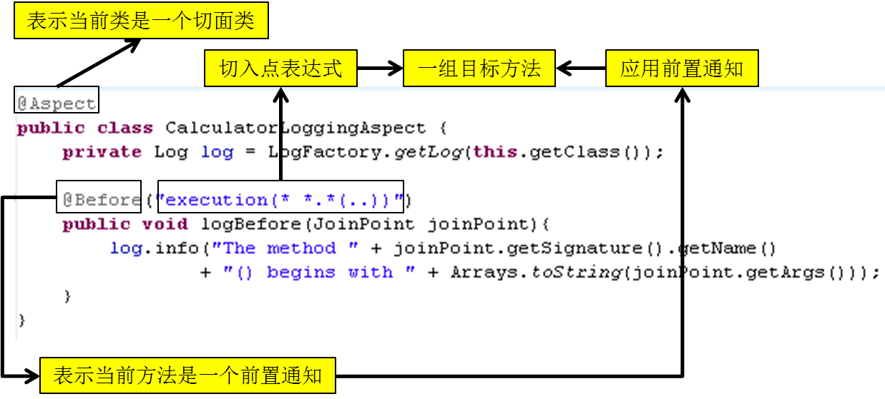

### 5.2 當前連接點細節
>#### 5.2.1 概述
>&nbsp;&nbsp;&nbsp;&nbsp;切入點運算式通常都會是從宏觀上定位一組方法，和具體某個通知的注解結合起來就能夠確定對應的連接點。那麼就一個具體的連接點而言，我們可能會關心這個連接點的一些具體資訊，例如：當前連接點所在方法的方法名、當前傳入的參數值等等。這些資訊都封裝在JoinPoint介面的實例物件中。
>#### 5.2.2 JoinPoint
>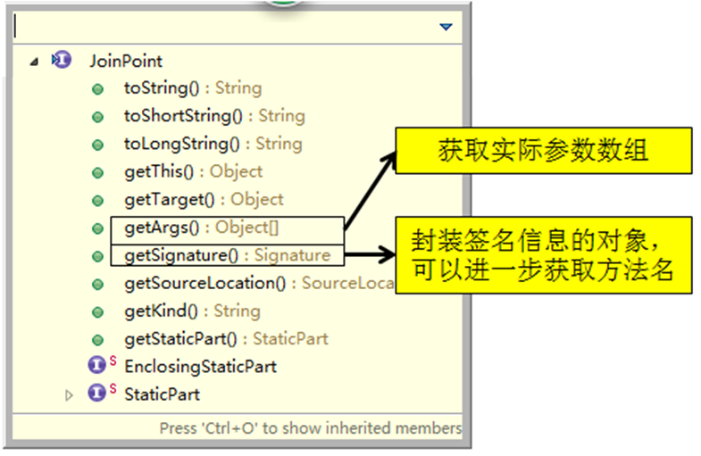
	
### 5.3 通知
>#### 5.3.1 概述
>	1. 在具體的連接點上要執行的操作。
>	2. 一個切面可以包括一個或者多個通知。
>	3. 通知所使用的注解的值往往是切入點運算式。
>#### 5.3.2 前置通知
>	1. 前置通知：在方法執行之前執行的通知
>	2. 使用@Before注解
>#### 5.3.3 後置通知
>	1. 後置通知：後置通知是在連接點完成之後執行的，即連接點返回結果或者拋出異常的時候
>	2. 使用@After注解
>#### 5.3.4 返回通知
>	1. 返回通知：無論連接點是正常返回還是拋出異常，後置通知都會執行。如果只想在連接點返回的時候記錄日誌，應使用返回通知代替後置通知。
>	2. 使用@AfterReturning注解,在返回通知中訪問連接點的返回值  
>	① 在返回通知中，只要將returning屬性添加到@AfterReturning注解中，就可以訪問連接點的返回值。該屬性的值即為用來傳入返回值的參數名稱  
>	② 必須在通知方法的簽名中添加一個同名參數。在運行時Spring AOP會通過這個參數傳遞返回值  
>	③ 原始的切點運算式需要出現在pointcut屬性中  
>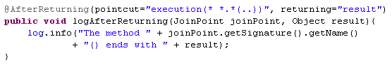
>#### 5.3.5 異常通知
>	1. 異常通知：只在連接點拋出異常時才執行異常通知
>	2. 將throwing屬性添加到@AfterThrowing注解中，也可以訪問連接點拋出的異常。Throwable是所有錯誤和異常類的頂級父類，所以在異常通知方法可以捕獲到任何錯誤和異常。
>	3. 如果只對某種特殊的異常類型感興趣，可以將參數聲明為其他異常的參數類型。然後通知就只在拋出這個類型及其子類的異常時才被執行 
>#### 5.3.6 環繞通知
>	1. 環繞通知是所有通知類型中功能最為強大的，能夠全面地控制連接點，甚至可以控制是否執行連接點。
>	2. 對於環繞通知來說，連接點的參數類型必須是ProceedingJoinPoint。它是 JoinPoint的子介面，允許控制何時執行，是否執行連接點。
>	3. 在環繞通知中需要明確調用ProceedingJoinPoint的proceed()方法來執行被代理的方法。如果忘記這樣做就會導致通知被執行了，但目標方法沒有被執行。
>	4. 注意：環繞通知的方法需要返回目標方法執行之後的結果，即調用 joinPoint.proceed();的返回值，否則會出現空指針異常。  
>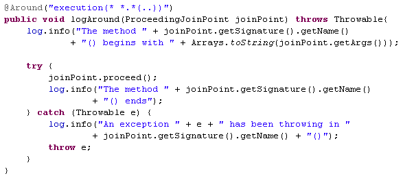
	
### 5.4 重用切入點定義
>	1. 在編寫AspectJ切面時，可以直接在通知注解中書寫切入點運算式。但同一個切點運算式可能會在多個通知中重複出現。
>	2. 在AspectJ切面中，可以通過@Pointcut注解將一個切入點聲明成簡單的方法。切入點的方法體通常是空的，因為將切入點定義與應用程式邏輯混在一起是不合理的。
>	3. 切入點方法的存取控制符同時也控制著這個切入點的可見性。如果切入點要在多個切面中共用，最好將它們集中在一個公共的類中。在這種情況下，它們必須被聲明為public。在引入這個切入點時，必須將類名也包括在內。如果類沒有與這個切面放在同一個包中，還必須包含包名。
>	4. 其他通知可以通過方法名稱引入該切入點  
>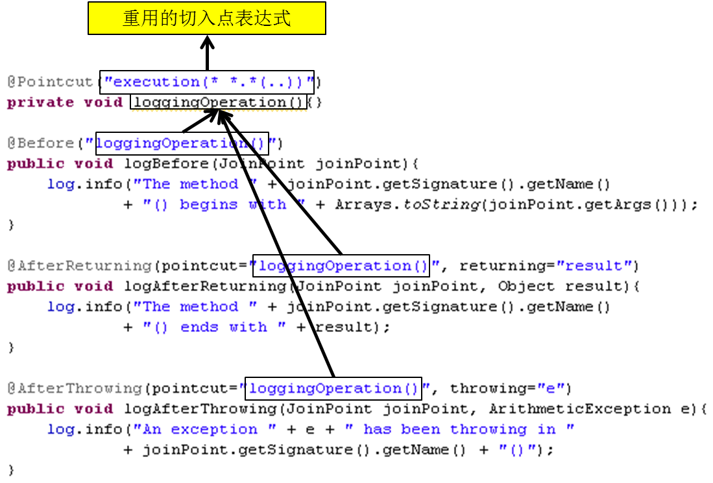

### 5.5 指定切面的優先順序
>	1. 在同一個連接點上應用不止一個切面時，除非明確指定，否則它們的優先順序是不確定的。
>	2. 切面的優先順序可以通過實現Ordered介面或利用@Order注解指定。
>	3. 實現Ordered介面，getOrder()方法的返回值越小，優先順序越高。
>	4. 若使用@Order注解，序號出現在注解中

