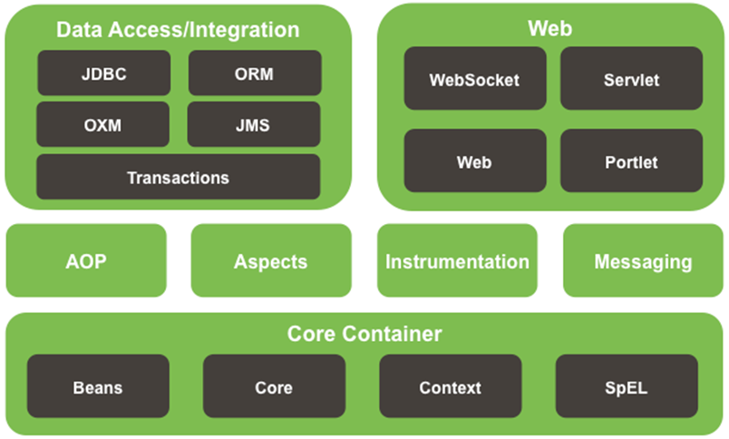
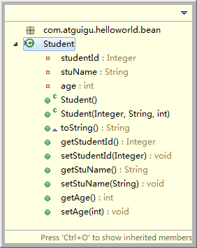
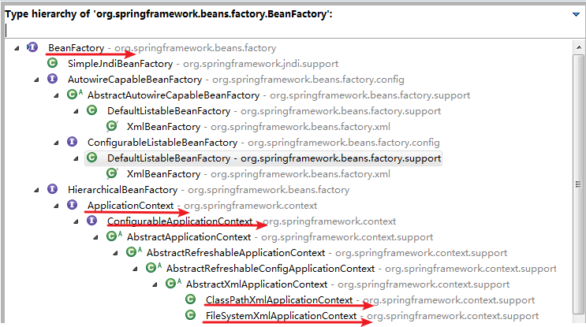

# 第0章	簡單了解框架
&nbsp;&nbsp;&nbsp;&nbsp;框架，即framework。其實就是某種應用的半成品，就是一組組件，供你選用完成你自己的系統。簡單說就是使用別人搭好的舞台，你來做表演。而且，框架一般是成熟的，不斷升級的軟件。  

&nbsp;&nbsp;&nbsp;&nbsp;框架是對特定應用領域中的應用系統的部分設計和實現的整體結構。  

因為軟件系統發展到今天已經很複雜了，特別是服務器端軟件，涉及到的知識，內容，問題太多。在某些方面使用別人成熟的框架，就相當於讓別人幫你完成一些基礎工作，你只需要集中精力完成系統的業務邏輯設計。而且框架一般是成熟，穩健的，他可以處理系統很多細節問題，比如，事務處理，安全性，數據流控制等問題。還有框架一般都經過很多人使用，所以結構很好，所以擴展性也很好，而且它是不斷升級的，你可以直接享受別人升級代碼帶來的好處
    
# 第1章	Spring概述

### 1.1 Spring概述
  1. Spring是一個開源框架    
  2. Spring為簡化企業級開發而生，使用Spring，JavaBean就可以實現很多以前要靠EJB才能實現的功能。同樣的功能，在EJB中要通過繁瑣的配置和復雜的代碼才能夠實現，而在Spring中卻非常的優雅和簡潔。
  3. Spring是一個IOC(DI)和AOP容器框架。
  4. Spring的優良特性
		- 非侵入式：基於Spring開發的應用中的對象可以不依賴於Spring的API
		- 依賴注入：DI——Dependency Injection，反轉控制(IOC)最經典的實現。
		- 面向切面編程：Aspect Oriented Programming——AOP
		- 容器：Spring是一個容器，因為它包含並且管理應用對象的生命週期
		- 組件化：Spring實現了使用簡單的組件配置組合成一個複雜的應用。在 Spring 中可以使用XML和Java註解組合這些對象。
		- 一站式：在IOC和AOP的基礎上可以整合各種企業應用的開源框架和優秀的第三方類庫（實際上Spring 自身也提供了表述層的SpringMVC和持久層的Spring JDBC）。
  5. Spring模塊  
  
	
### 1.2 搭建Spring運行時環境
  1. 加入JAR包  
		1.1 Spring自身JAR包：spring-framework-4.0.0.RELEASE\libs目錄下  
		`spring-beans-4.0.0.RELEASE.jar`    
		`spring-context-4.0.0.RELE2ASE.jar`  
		`spring-core-4.0.0.RELEASE.jar`  
		`spring-expression-4.0.0.RELEASE.jar`  
		1.2 commons-logging-1.1.1.jar
  2. 在Spring Tool Suite工具中通過如下步驟創建Spring的配置文件  
		2.1 File->New->Spring Bean Configuration File  
		2.2 為文件取名字 例如：applicationContext.xml
		
### 1.3 HelloWorld
  1. 目標：使用Spring創建對象，為屬性賦值
  2. 創建Student類  
  
  3. 創建Spring配置文件  
  ```
	<!-- 使用bean元素定義一個由IOC容器創建的對象 -->
	<!-- class屬性指定用於創建bean的全類名 -->
	<!-- id屬性指定用於引用bean實例的標識 -->
	<bean id="student" class="com.atguigu.helloworld.bean.Student">
		<!-- 使用property子元素為bean的屬性賦值 -->
		<property name="studentId" value="1001"/>
		<property name="stuName" value="Tom2015"/>
		<property name="age" value="20"/>
	</bean>
  ```
  4. 測試：通過Spring的IOC容器創建Student類實例  
  ```
	//1.创建IOC容器对象
	ApplicationContext iocContainer = new ClassPathXmlApplicationContext("helloworld.xml");
	
	//2.根据id值获取bean实例对象
	Student student = (Student) iocContainer.getBean("student");
	
	//3.打印bean
	System.out.println(student);
  ```
	  
# 第2章 IOC容器和Bean的配置
	  
### 2.1 IOC和DI
>#### 2.1.1 IOC(Inversion of Control)：反轉控制  
>&nbsp;&nbsp;&nbsp;&nbsp;在應用程序中的組件需要獲取資源時，傳統的方式是組件主動的從容器中獲取所需要的資源，在這樣的模式下開發人員往往需要知道在具體容器中特定資源的獲取方式，增加了學習成本，同時降低了開發效率。  
>&nbsp;&nbsp;&nbsp;&nbsp;反轉控制的思想完全顛覆了應用程序組件獲取資源的傳統方式：反轉了資源的獲取方向——改由容器主動的將資源推送給需要的組件，開發人員不需要知道容器是如何創建資源對象的，只需要提供接收資源的方式即可，極大的降低了學習成本，提高了開發的效率。這種行為也稱為查找的被動形式。  
>&nbsp;&nbsp;&nbsp;&nbsp;傳統方式:   我想吃飯    我需要買菜做飯  
>&nbsp;&nbsp;&nbsp;&nbsp;反轉控制:   我想吃飯    飯來張口
>#### 2.1.2 DI(Dependency Injection)：依賴注入
>&nbsp;&nbsp;&nbsp;&nbsp;IOC的另一種表述方式：即組件以一些預先定義好的方式(例如：setter 方法)接受來自於容器的資源注入。相對於IOC而言，這種表述更直接。  
>&nbsp;&nbsp;&nbsp;&nbsp;總結: IOC 就是一種反轉控制的思想， 而DI是對IOC的一種具體實現。
>#### 2.1.3 IOC容器在Spring中的實現
>&nbsp;&nbsp;&nbsp;&nbsp;前提:  Spring中有IOC思想，  IOC思想必須基於 IOC容器來完成， 而IOC容器在最底層實質上就是一個對象工廠.  
>1. 在通過IOC容器讀取Bean的實例之前，需要先將IOC容器本身實例化。  
>2. Spring提供了IOC容器的兩種實現方式  
>		2.1 BeanFactory：IOC容器的基本實現，是Spring內部的基礎設施，是面向Spring本身的，不是提供給開發人員使用的。  
>		2.2 ApplicationContext：BeanFactory的子接口，提供了更多高級特性。面向Spring的使用者，幾乎所有場合都使用ApplicationContext而不是底層的BeanFactory。
>#### 2.1.4 ApplicationContext的主要實現類
>1. ClassPathXmlApplicationContext：對應類路徑下的XML格式的配置文件
>2. FileSystemXmlApplicationContext：對應文件系統中的XML格式的配置文件
>3. 在初始化時就創建單例的bean，也可以通過配置的方式指定創建的Bean是多實例的。
>#### 2.1.5 ConfigurableApplicationContext
>1. 是ApplicationContext的子接口，包含一些擴展方法
>2. refresh()和close()讓ApplicationContext具有啟動、關閉和刷新上下文的能力。
>#### 2.1.6 WebApplicationContext
>1. 專門為WEB應用而準備的，它允許從相對於WEB根目錄的路徑中完成初始化工作
>#### 2.1.7 容器的結構圖  
>

### 2.2 通過類型獲取bean
1. 從IOC容器中獲取bean時，除了通過id值獲取，還可以通過bean的類型獲取。但如果同一個類型的bean在XML文件中配置了多個，則獲取時會拋出異常，所以同一個類型的bean在容器中必須是唯一的。  
`HelloWorld helloWorld = cxt.getBean(HelloWorld. class);`
2. 或者可以使用另外一個重載的方法，同時指定bean的id值和類型  
`HelloWorld helloWorld = cxt.getBean(“helloWorld”,HelloWorld. class);`

### 2.3 給bean的屬性賦值
>#### 2.3.1 依賴注入的方式
>1. 通過bean的setXxx()方法賦值  
>Hello World中使用的就是這種方式  
>
>2. 通過bean的構造器賦值  
>		2.1 Spring自動匹配合適的構造器  
>```
>	<bean id="book" class="com.atguigu.spring.bean.Book" >
>		<constructor-arg value= "10010"/>
>		<constructor-arg value= "Book01"/>
>		<constructor-arg value= "Author01"/>
>		<constructor-arg value= "20.2"/>
>	</bean >
>```
>&nbsp;&nbsp;&nbsp;&nbsp;
>		2.2 通過索引值指定參數位置  
>```
>	<bean id="book" class="com.atguigu.spring.bean.Book" >
>		<constructor-arg value= "10010" index ="0"/>
>		<constructor-arg value= "Book01" index ="1"/>
>		<constructor-arg value= "Author01" index ="2"/>
>		<constructor-arg value= "20.2" index ="3"/>
>	</bean >
>```
>&nbsp;&nbsp;&nbsp;&nbsp;
>		2.3 通過類型區分重載的構造器  
>```
>	<bean id="book" class="com.atguigu.spring.bean.Book" >
>		<constructor-arg value= "10010" index ="0" type="java.lang.Integer" />
>		<constructor-arg value= "Book01" index ="1" type="java.lang.String" />
>		<constructor-arg value= "Author01" index ="2" type="java.lang.String" />
>		<constructor-arg value= "20.2" index ="3" type="java.lang.Double" />
>	</bean >
>```